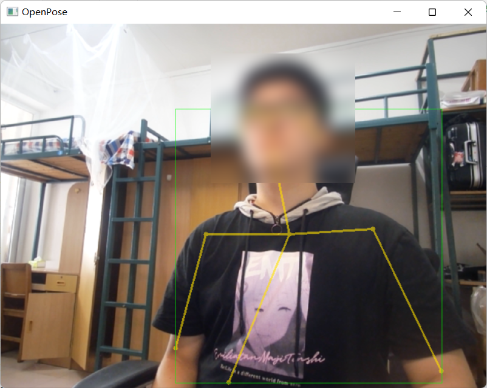

# openpose-jetson-demo

Part of my Hardware Course Project (2022 Spring). A OpenPose pose estimation demo for Jetson Nano, based on [Lightweight OpenPose](https://github.com/Daniil-Osokin/lightweight-human-pose-estimation.pytorch).

## Requirements

- Python 3.x
- NVIDIA CUDA 11.x
- Python Packages
  - PyTorch (if you need to run the original demo)
  - ONNX Runtime
  - NumPy
  - OpenCV

The `requirements.txt` is out-of-date, do NOT install requirements by using it.

## Usage

### Run demo

Pretrained models: [Google Drive](https://drive.google.com/drive/folders/1Hn1pf5vM6BaUZJKfnv274L8Ch_N_M0Ci?usp=sharing), based on the [original model](https://download.01.org/opencv/openvino_training_extensions/models/human_pose_estimation/checkpoint_iter_370000.pth). ONNX model files are named with its specified input size like 128x128, 256x256 and 512x512. Recommend 256x256 for embedded devices.

Put the pretrained ONNX model file in the root folder and change the `resize_size` in `app_demo.py` Line 10.

Then simply run `python3 app_demo.py` and wait a moment for loading model, the preview window and server is up.

### Capture animation

In the preview window press key C to start and stop capturing. When capture starts, `capture start` will be output to the console. When capture ends, the animation will be saved as `capture_xxxx.oanim` in the root folder. The OANIM format can be converted to Unity animation by using [openpose-jetson-unity-demo](https://github.com/KSkun/openpose-jetson-unity-demo).

